# 使用本仓库前请完整的阅读本文档

## 本仓库所有内容仅供参考，其真实性、有效性等请自行判断。

## 本仓库包含南京大学计算机专业考研的资料（公共课和专业课）

包含数学一、英语一、政治、算法设计与分析、数据结构、计算机系统基础、操作系统教程、计算机网络：自顶向下方法

## 一段时间之后，因为上传缓存会导致仓库的大小为实际的2倍以上，所以会在某个时间点重置仓库。将之前的提交删除，清空缓存，以保证仓库不会太大。

## 刷题软件已经基本完成，我将尝试将期末考试、模拟题、其他题库的题目添加到软件数据库中，如果效果不好或者出现其他问题会将资料重新添加回来。

## 如果需要重置之前的资料可以到码云下载，可以达到2M/S的速度。

## 本仓库的参考书目PDF及其他PDF文件可以到百度云或者微云下载。（文件待上传）

## 书本参考答案会不断上传

## 本仓库所有内容完全免费，但是有的资料会有水印

# 目录

1. [说明](#说明)
2. [友情链接](#友情链接)
3. [联系方式](#联系方式)
4. [考试相关](#考试相关)
   - [考试时间线](#考试时间线)
   - [845考试调整说明](#845考试调整说明)
   - [复试安排](#复试安排)
5. [仓库内容](#仓库内容)
   - [录取信息](#0.录取信息)
   - [初试](#1.初试)
   - [复试](#2.复试)
   - [其他资料](#3.其他资料)
   - [图片](#img)
6. [附加资料](#附加资料)
7. [考研科目细节](#考研科目细节)
   - [初试](#初试)
   - [复试](#复试)
8. [其他资料](#其他资料)
9. [参考资料](#参考资料)

# 友情链接

## 计算机考研，这样选学校才是正解

***扫盲：正式复习之前可以看看***

https://blog.csdn.net/harvic880925/article/details/103193905

## 刷了几千道算法题，这些我私藏的刷题网站都在这里了！

***算法、上机等等可以看看这个***

https://blog.csdn.net/u013486414/article/details/102961171

## CS AI 仓库

https://github.com/nju-kaoyan/nju_csai_kaoyan

## 复试经验贴

https://github.com/ThyrixYang/nju_cs_kaoyan_19/wiki

## 龙书答案

https://github.com/fool2fish/dragon-book-exercise-answers

# 说明

**南京大学计算机考研资料合集**

**包括报录比、真题、模拟题、PPT、期末考试等等**

***PS:只是整合，所以有的资料上面会有其他机构、论坛、公众号的广告。***

1、本仓库内的资料完全免费，所有资料首先保持没有水印，其次在能分辨内容的情况下使用带水印的资料。

2、如果有看不清，或者其他原因导致资料使用过程中出现问题的，欢迎通知我。

3、对于文档，为了保持文本格式，优先考虑PDF格式。

4、当仓库内容趋于稳定后或者我得到结果后会考虑微云或者百度网盘之类的。

5、码云中的仓库内容基本上保持同步更新，可能会延迟。

6、操作系统参数

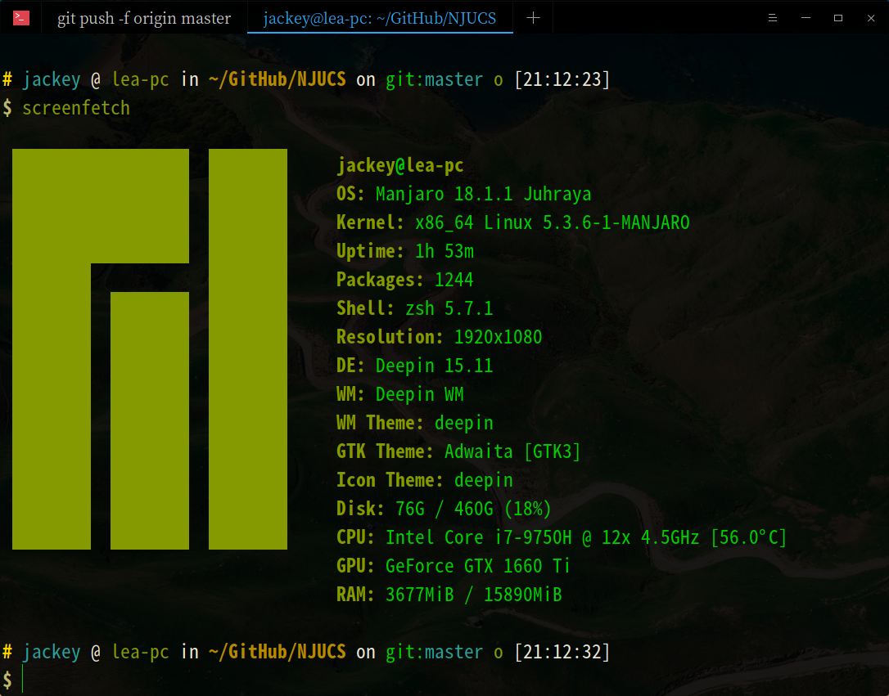

Office 软件为 WPS for Linux 11.1.0.8865

PDF软件为 master editor of PDF

7、上传速度

下载速度

测试日期：2019-11-18

测试日期：2019-11-21

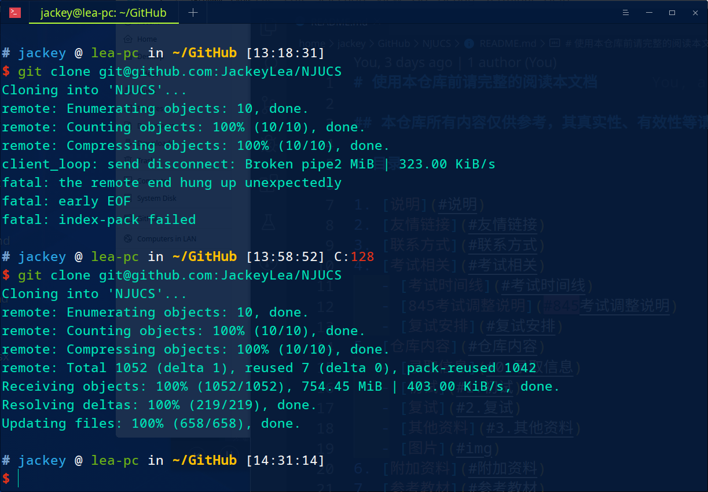

可以看出第一次下载较慢，第二次下载时就正常了。

测试日期：2019-12-10

码云clone测试，2M/s的速度可以接收。

8、如果阁下想添加资料至本仓库，请遵循以下原则：

(1) 无法上传至仓库的资料必须完全免费，比如说B站的视频、没有版权需要自己处理的PDF、在线微课等等；

(2) 优先考虑没有水印，或者水印较少的资料。如果没有其他选择，可以上传带水印或者不清晰的资料；

(3) 暂时还没有想到，因为除了我还没有人添加资料。

9、课后习题答案采用Markdown文件编写，可以导出为PDF打印。

## 仓库大小

这是本仓库最新的时间内所有文件的大小

# 联系方式

作者：幽弥狂

电话：13812991101

邮箱：1768478912@qq.com

QQ：1768478912 （往事深处的少年）

交流群：550150534

研究生考试报名有点问题，今年不考了。明年的事明年在说。

仓库内容随缘更新

***交流群是在别人经验里看来的，考虑到维护一个群的时间和经验，使用别人的现有群。按照群的要求，不许灌水，只能进行专业交流，如果有兴趣，可以考虑考虑***

群主授权

如果觉得考研太难就放弃吧，人生苦短，及时行乐。

我现在在准备2019年12月份的考试，2020年三月份之后会根据本人的考试复习情况进行资料细节调整

**如果有任何版权或者其他问题，欢迎联系我，我会尽快解决**

# 考试相关

## 考试时间线

***2019年***

***研究生招生网站：https://yz.chsi.com.cn/***

### 预报名

2019年9月24日至9月27日，每天9：00~22:00

***报名时备用信息无明确要求***

### 网上报名

2019年10月10日至10月31日

### 现场确认

由省级招生办公布

### 下载准考证

2019年12月14日至2019年12月23日（24小时开放）

### 初试时间

2019年12月21日至12月23日

## 845考试调整说明

删除《计算机组成原理》科目，添加《计算机系统基础》

**考虑到题型变化，本仓库从2019年9月18日起只有2013年以后的真题，其中2017年开始是最新版题目分布，推荐重点研究2017年以后的真题**

## 复试安排

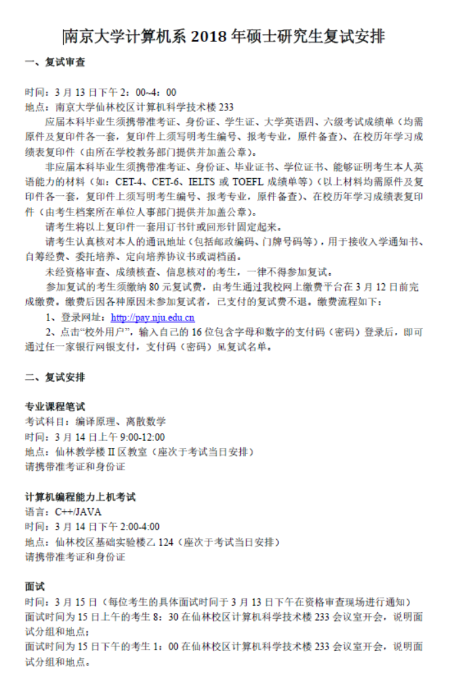

# 仓库内容

## 0.录取信息

包含报录比、拟录取名单、分数线、基本分数线

## 1.初试

初试相关的资料（真题、PPT、期末考试），包括算法、数据结构、计算机系统基础、计算机网络、操作系统、初试/复试需要的课本PDF及配套资料（PPT和课后习题参考答案等）

上传的408真题我暂时也不知道有没有用，先放着吧。有兴趣的可以看看

因为真题参考答案准确率太低，暂时不上传了。

***所谓的数据结构1800题，其实是由机械工业出版社出版的《算法与数据结构 考研试题精析》 陈守孔 胡潇琨 李玲编著。在淘宝可以买到。本仓库中的文档根据内容判断，应该是第二版或者更早的第一版的。***

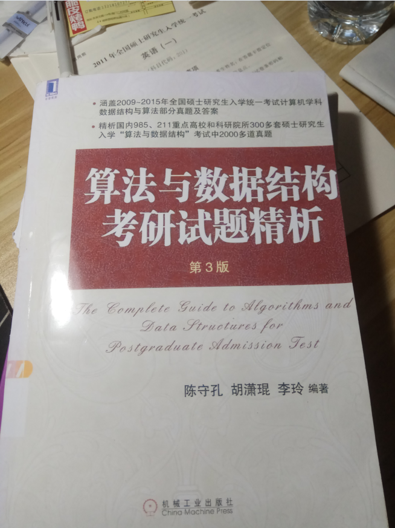

## 2.复试

复试相关资料，包括英语听力、离散数学、编译原理、上机

## 3.其他资料

一些资料不知道该如何分类，也不知道有什么用，就放在这里面

## img 

说明文档所需要的图片文件

# 附加资料

## 刷题软件

为了方便刷题和查找题目等等目的，现添加一个刷题软件。

包括数据结构、算法、计算机网络、计算机系统基础等等，除了真题和课后习题之外的所有习题包括其他书的习题、辅导班的书、

一些参考书习题、网上的习题都会添加在里面。

可以重复刷题，有提示和参考答案，如果需要打印可以导出为PDF或者docx。

刷题软件完成之后，根据我的复习情况，会将仓库中的所有题目（除真题以外）添加到软件数据库中，并且删除仓库中的内容。

如果需要刷题可以，下载下来看看。如果想参考qt软件开发也可以下载下来看看。

具体内容见刷题软件界面。

地址：https://github.com/JackeyLea/NJUCS-exercise 这个仓库包含845专业课题目

地址：https://github.com/JackeyLea/Interview_questions 这个仓库包含C++等语言面试题目等

# 考研科目细节

***从群里搞到的新版参考书目，来源未知***

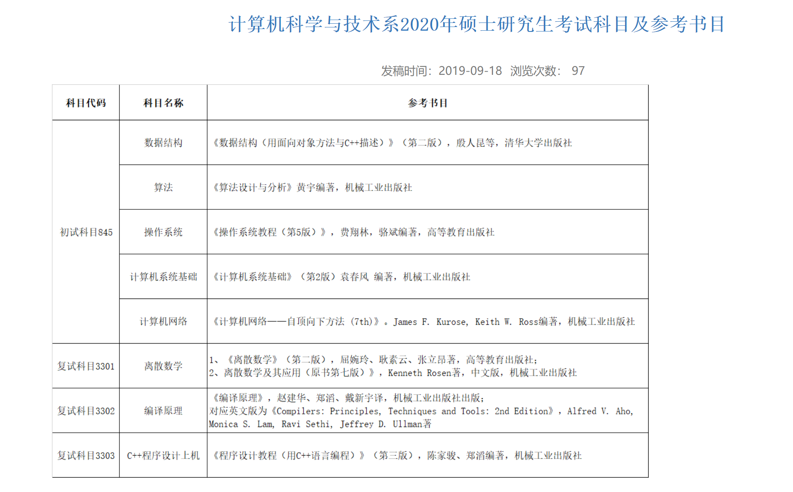

## 初试

### 数学一

不推荐张宇

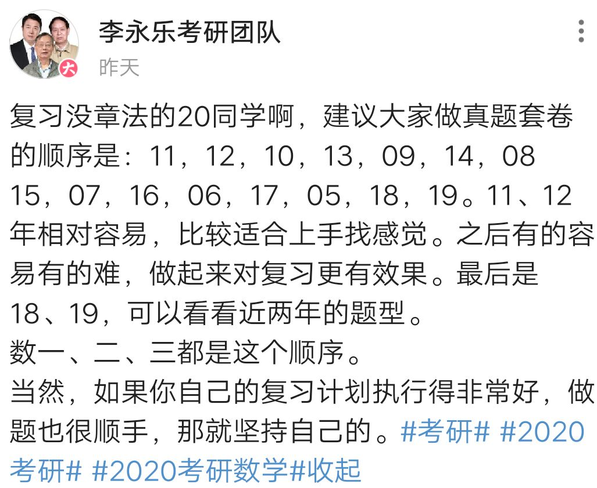

### 英语一

推荐百词斩

### 政治

参考资料不用说了，肖大爷是你唯一的依靠

但是，如果你平时有空，我推荐一个微信小程序

免费使用，但是每天刷一套题，如果多刷就需要up点；

每次刷完题就会得到up点，如果1000题刷完会得到10000点。

我已经快要刷完1000题了，开心

### 《数据结构（用面向对象方法与C++描述）》（第二版），殷人昆等，清华大学出版社；

.png)

***带星号的一般不会考***

重点关注线性表、树、图、排序算法（时间/空间）、AVL树、B树

视频：

<a href="https://www.bilibili.com/video/av23317136?p=1">数据结构与算法</a>

<a href="https://www.bilibili.com/video/av38920216/">西北大学 - 数据结构 （国家级精品课，好课啊，推荐）</a>

课后习题参考答案在：<a href="https://github.com/JackeyLea/DS_exercises">DS_exercises</a>

### 算法设计与分析，黄宇，机械工业出版社；

因为黄宇是教这门课的。

重点动态规划、DP问题（背包/换硬币/跳台阶） ***主要是复试时***

剑指offer

<a href="https://www.bilibili.com/video/av64662783/">北京大学-算法设计与分析（国家级精品课）</a>

课后习题参考答案在：

### 操作系统教程（第5版），费翔林，骆斌编著，高等教育出版社；

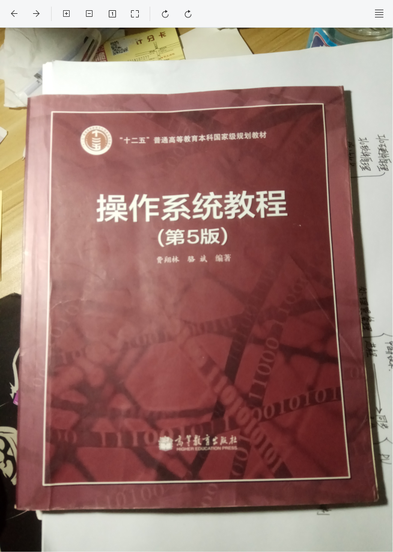

重点包括：中断、内存管理、PV操作（N生产者N消费者/共浴/理发师）

<a href="https://www.icourse163.org/course/NJU-1001571004">计算机操作系统</a>

课后习题参考答案在：<a href="https://github.com/JackeyLea/IOS_exercise">IOS_exercise</a>

### 计算机系统基础（第二版），袁春风 编著，机械工业出版社 ；

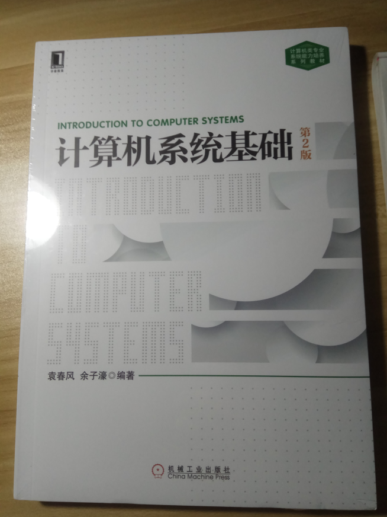

同时，配套的习题册，据说会考到。

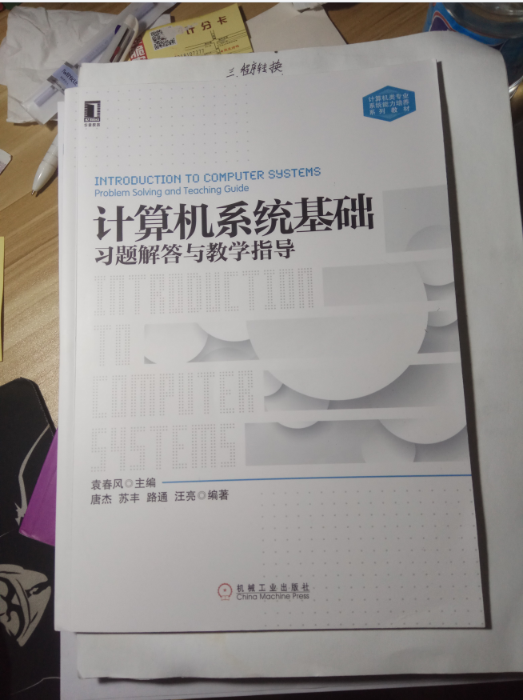

关注第2/3/5/7/8章的选择题、第6章的分析应用题

慕课：

<a href="https://www.icourse163.org/course/0809NJU008-1001625001">计算机系统基础(一)：程序的表示、转换与链接</a>

<a href="https://www.icourse163.org/course/0809NJU008B-1001964032">计算机系统基础（二）：程序的执行和存储访问</a>

<a href="https://www.icourse163.org/course/0809NJU008C-1002532004">计算机系统基础(三)：异常、中断和输入/输出</a>

B站也有视频

课后习题参考答案在：<a href="https://github.com/JackeyLea/ICS_exercise">ICS_exercise</a>

### 计算机网络——自顶向下方法 (6th)。James F. Kurose, Keith W. Ross编著，机械工业出版社；

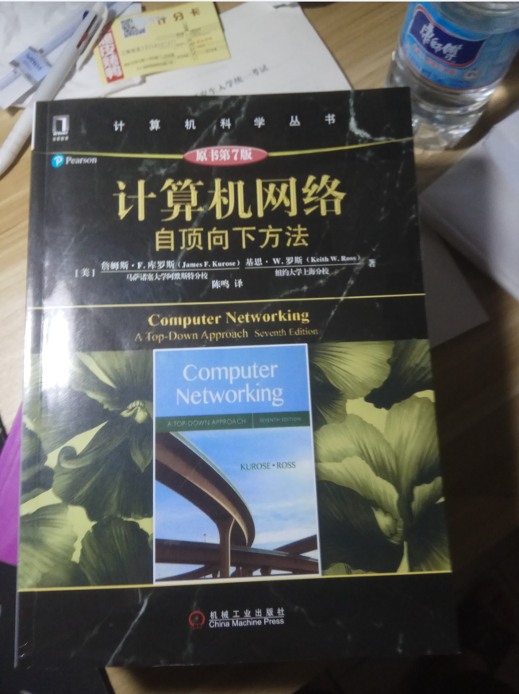

应用层（http）、传输层（TCP）、网络层（IpV4及相关协议）、链路层（以太网）、SSL

<a href="https://www.bilibili.com/video/av41404195?from=search&seid=1062244817660809468">计算机网络（自顶向下方法）</a>

<a href="https://www.bilibili.com/video/av58999844?from=search&seid=1062244817660809468">国防科技大学-计算机网络（国家级精品课）</a>

中文版参考答案在：<a href="https://github.com/JackeyLea/CN-exercise">CN-exercise</a>

版本号：V2.0.2019.11.23

## 复试

### 离散数学（第2版），屈婉玲，高等教育出版社；

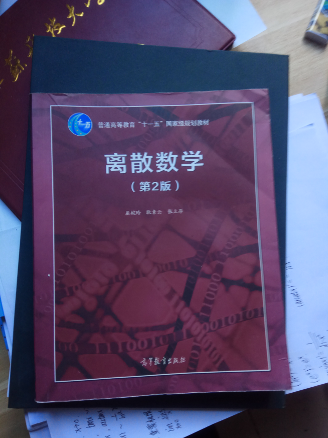

逻辑、计数计术、群论、图论、边收缩、非降路径

<a href="https://www.bilibili.com/video/av66617565?p=1">北京大学-离散数学（国家级精品课）</a>

<a href="https://www.bilibili.com/video/av59326261/">吉林大学-离散数学（国家级精品课）</a>

<a href="https://www.icourse163.org/course/USTB-1206407811">离散数学</a>

### 离散数学及其应用（原书第6版），Rosen，机械工业出版社；

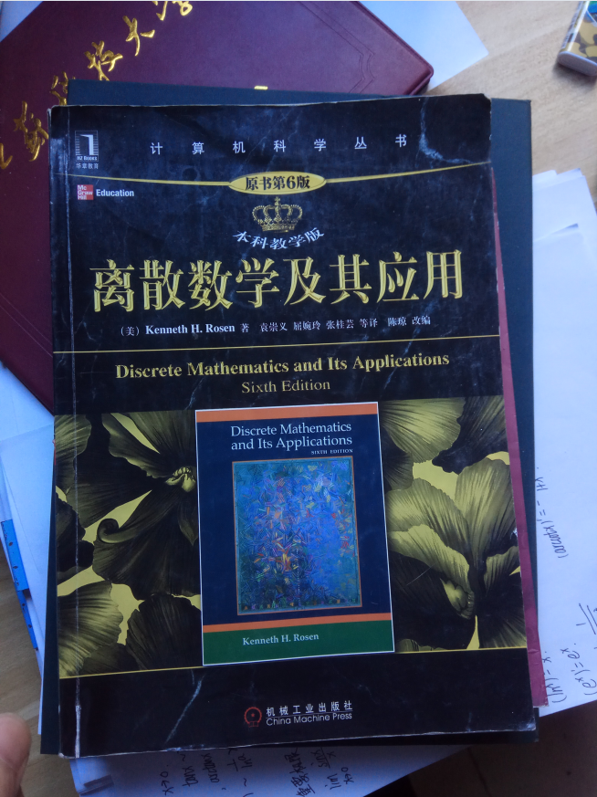

### 程序设计教程 用C++语言描述，陈家俊，机械工业出版社；

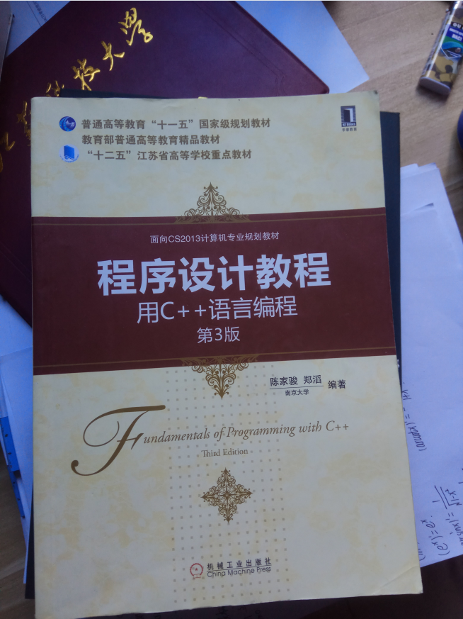

推荐 黄宇算法教材（从别人经验上看来的）

重点动态规划、DP问题（背包/换硬币/跳台阶） ***主要是复试时***

剑指offer

### 编译原理，龙书，机械工业出版社；

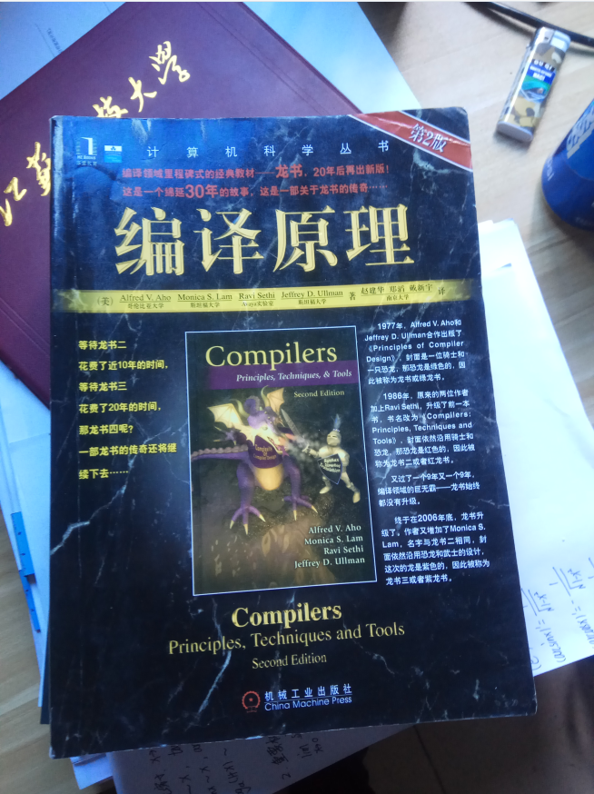

DFA-NFA、LL分析法、LR分析法、SDD-SDT、翻译、回填

***PPT***

<a href="https://www.bilibili.com/video/av17649289?from=search&seid=7144683529622357495">编译原理（哈工大）</a>

# 其他资料

## 本科课表

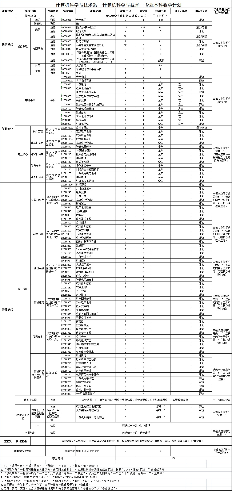

## 硕士研究生课表

待补充

## 路线-地铁

## 南大仙林校区介绍

## 南大仙林校区地图

## 校车班车列表

## 南大机构电话

# 参考资料

[1] https://cs.nju.edu.cn/lwz/algorithm/

[2] https://cs.nju.edu.cn/algorithm/slides.html

[3] https://blog.csdn.net/huang1024rui/article/details/49154507

[4] 思维导图.https://github.com/SSHeRun/CS-Xmind-Note

[5] 计算机网络：自顶向下第七版 英文版资料 http://www-net.cs.umass.edu/kurose-ross-ppt-7e/ https://github.com/HanochShi/Supplements-ComputerNetworking-ATopDownApproach-7th-ed https://github.com/myk502/Top-Down-Approach

很幸运我们在此相会，感谢阁下对本资料库的厚爱

如果有任何的建议或者意见，欢迎提出来

同时也欢迎大家更新新版本的资料

切记：少玩手机，多看书，多刷题

有空的话希望点个小星星表示资源有用，如果资料过时或者其他问题欢迎提出来。

[回到顶部](#目录)